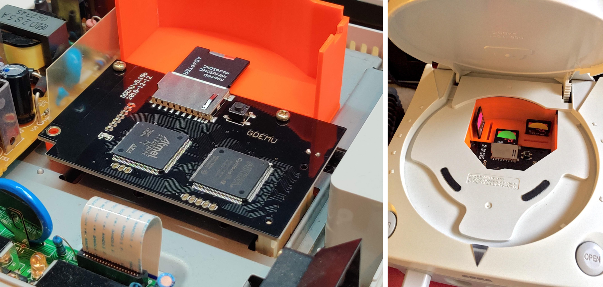
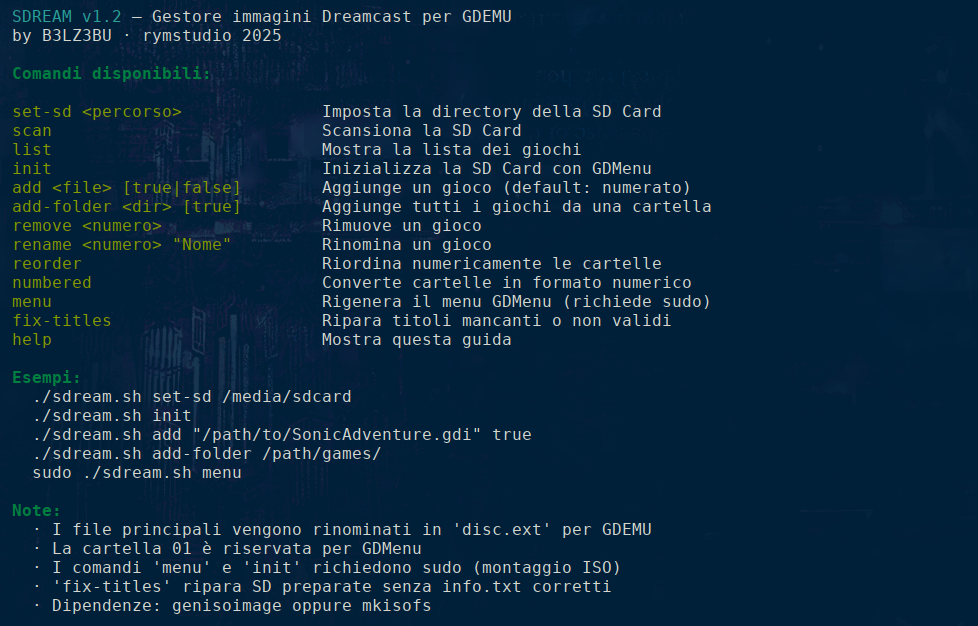

##### SDream V 1.2 by rymstudio

SDream è uno script bash che vi permette di creare e gestire archivi di giochi/ROM per Sega Dreamcast da utilizzare su GDEMU attraverso una memoria di archiviazione SD.

**Cosa è GDEMU?** GDEMU è una periferica hardware che va a sostituire in toto la lente di lettura dei dischi del Dreamcast: i vostri GD-Rom potranno essere utilizzati come immagini direttamente archiviate su una memoria esterna di tipo SD.



Questa periferica è facilmente acquistabile sui principali shop online di elettronica, il costo è tutto sommato contenuto, l'installazione è semplicissima e non richiede saldature di alcun genere — tutto si fa collegando il flat cable e fissando la scheda con supporti in plastica a pressione.

**Come funziona GDEMU?** Una volta installato sul Dreamcast, GDEMU inganna la console facendole credere di essere un lettore CD/GDI e avvia il software necessario per la gestione della memoria SD e delle immagini di gioco caricate su di essa. Molto comodo per non usurare con il continuo utilizzo i vostri GD-Rom originali: potrete giocare le vostre copie di backup senza il fastidio di inserire, aprire, chiudere il coperchio ogni volta.

**A che serve SDream?** SDream è uno strumento per inizializzare, popolare e gestire le cartelle con le vostre ROM all'interno della SD da utilizzare su GDEMU. Non basta copiare i giochi sulla scheda di memoria: GDEMU richiede una precisa organizzazione dei file e questo strumento si occupa di tutto in automatico.

Esistono alcuni tool per Windows ma non ho trovato nulla di davvero funzionante in ambiente Linux. Analizzato il funzionamento del tool GD-SDMaker per Windows ho immaginato di poterlo realizzare in maniera analoga anche su Linux. Non sono uno sviluppatore e mi sono arrangiato con la bash: questo ha portato a dei compromessi, ma il risultato funziona.



---

**Installazione e compatibilità**

SDream è sviluppato su piattaforma Debian-like, testato su Linux Mint, Ubuntu, Pop-OS e Debian (con `sudo` abilitato). Alcuni comandi richiedono i privilegi di amministratore (`sudo`) per funzionare, in particolare `init` e `menu`, che si occupano rispettivamente dell'inizializzazione della scheda SD e della rigenerazione del menu di selezione dei giochi.

Per funzionare SDream ha bisogno di alcuni strumenti e file esterni:

- **`genisoimage`** — strumento per la creazione di file `.iso`. Lo script ne verifica la presenza e in caso contrario suggerisce l'installazione tramite `apt`. Maggiori informazioni: https://linux.die.net/man/1/genisoimage

- **`gdmenu.tar.gz`** — contiene i file necessari per il boot e il caricamento del menu di selezione titoli all'avvio su Dreamcast. Deve essere scaricato e trovarsi nella stessa cartella dello script `sdream.sh`. Potete recuperarlo con:

  ```bash
  wget https://www.rymstudio.it/sdream/gdmenu.tar.gz
  ```

Per comodità, di seguito uno script che automatizza l'installazione e il recupero di tutti i file necessari:

```bash
#!/bin/bash

echo "Creo cartella sdream..."
mkdir sdream && cd sdream

echo "Scarico gdmenu da rymstudio.it..."
wget https://www.rymstudio.it/sdream/gdmenu.tar.gz

echo "Scarico SDream da rymstudio.it..."
wget https://www.rymstudio.it/sdream/sdream.tar.gz

echo "Installo genisoimage..."
sudo apt install genisoimage -y

echo "Decomprimo l'archivio di SDream..."
tar -xzvf sdream.tar.gz

echo "Rendo eseguibile SDream..."
chmod +x sdream.sh
rm sdream.tar.gz

echo "Installazione completata!"
```

---

**Come utilizzare SDream**

Lanciando `./sdream.sh` senza parametri, oppure con `--help` o `-h`, si ottiene il riepilogo dei comandi disponibili:

```
  SDREAM v1.2 — Gestore immagini Dreamcast per GDEMU
  by B3LZ3BU · rymstudio 2025

  Comandi disponibili:

  set-sd <percorso>              Imposta la directory della SD Card
  scan                           Scansiona la SD Card
  list                           Mostra la lista dei giochi
  init                           Inizializza la SD Card con GDMenu
  add <file> [true|false]        Aggiunge un gioco (default: numerato)
  add-folder <dir>               Aggiunge tutti i giochi da una cartella
  remove <numero>                Rimuove un gioco
  rename <numero> "Nome"         Rinomina un gioco
  reorder                        Riordina numericamente le cartelle
  numbered                       Converte cartelle in formato numerico
  menu                           Rigenera il menu GDMenu (richiede sudo)
  fix-titles                     Ripara titoli mancanti o non validi
  help                           Mostra questa guida

  Note:
    · I file principali vengono rinominati in 'disc.ext' per compatibilità GDEMU
    · La cartella 01 è riservata per GDMenu
    · I comandi 'menu' e 'init' richiedono sudo (montaggio ISO)
    · 'fix-titles' ripara SD preparate senza info.txt corretti
    · Dipendenze: genisoimage oppure mkisofs
```

---

**Flusso di lavoro tipico**

Il modo più rapido per inizializzare una SD e caricare tutti i giochi in una volta sola:

```bash
# 1. Imposta il percorso della SD Card
./sdream.sh set-sd /media/utente/nome_sd

# 2. Inizializza la SD con GDMenu (richiede sudo)
sudo ./sdream.sh init

# 3. Aggiungi i giochi da una cartella sorgente
./sdream.sh add-folder /home/utente/miei_giochi_dreamcast

# 4. Rigenera il menu (richiede sudo)
sudo ./sdream.sh menu

# 5. Verifica il risultato
./sdream.sh list
```

---

**Riferimento comandi**

**`set-sd`** — definisce il percorso di mount della scheda SD per la sessione di lavoro. La SD deve essere formattata in FAT32 (operazione non inclusa nello script).

```bash
./sdream.sh set-sd /media/utente/nome_sd
```

Il percorso viene salvato in `~/.gdemu_mini/config.conf` e riutilizzato nelle sessioni successive. Il comando funziona correttamente anche quando lo script è eseguito con `sudo`.

---

**`scan`** — esegue una scansione del contenuto della scheda SD al percorso impostato con `set-sd`. Le cartelle di sistema (`.Trash`, `System Volume Information`, ecc.) vengono ignorate automaticamente.

```
Scansione della SD Card in corso...
Trovati 24 giochi nella SD Card.
```

---

**`list`** — mostra la lista dei giochi presenti sulla SD con numero cartella, titolo, dimensione e formato.

```
#     TITOLO                                     DIM.       TIPO
───────────────────────────────────────────────────────────────────
01    GDMENU                                     1 MB       GDI
02    SOUL CALIBUR                               1 GB       CDI
03    STREET FIGHTER III - 3RD STRIKE            1 GB       CDI
04    MARVEL VS. CAPCOM 2                        1 GB       CDI
...

Totale: 24 giochi
```

---

**`init`** — richiede `sudo`. Inizializza la SD Card installando GDMenu nella cartella `01`, creando il file `GDEMU.ini` con la configurazione standard e generando il menu di selezione giochi.

```bash
sudo ./sdream.sh init
```

Richiede che il file `gdmenu.tar.gz` si trovi nella stessa cartella dello script.

---

**`add`** — aggiunge un singolo file di gioco alla SD Card con numerazione automatica. Supporta i formati `.gdi`, `.cdi`, `.iso`, `.ccd`, `.mds`, `.chd`. Per i formati multi-file (GDI, CCD, MDS) vengono copiati automaticamente anche i file associati (tracce, `.img`, `.mdf`).

```bash
./sdream.sh add /home/utente/giochi/SonicAdventure.gdi
```

---

**`add-folder`** — analizza una cartella sorgente e importa tutti i giochi trovati, gestendo automaticamente due layout:

- **File flat** — immagini `.cdi`, `.gdi`, ecc. direttamente nella root della cartella sorgente
- **Sottocartelle per gioco** — ogni gioco in una propria sottocartella (es. come scaricati da alcuni archivi)

I due layout possono coesistere nella stessa cartella sorgente senza generare duplicati.

```bash
./sdream.sh add-folder /home/utente/miei_giochi_dreamcast
```

Al termine viene aggiornato automaticamente il menu GDMenu (richiede `sudo` per il montaggio dell'ISO).

---

**`remove`** — rimuove dalla SD il gioco indicato tramite il suo numero di cartella, previa conferma interattiva. Dopo la rimozione il menu viene rigenerato automaticamente.

```bash
./sdream.sh remove 04
```

---

**`rename`** — modifica il titolo visualizzato nel menu GDMenu per un gioco specifico.

```bash
./sdream.sh rename 04 "Street Fighter 3 - 3rd Strike"
```

---

**`reorder`** — riassegna i numeri delle cartelle in sequenza continua a partire da `02`, eliminando eventuali buchi nella numerazione (ad esempio dopo una rimozione). Rigenera il menu al termine.

```bash
./sdream.sh reorder
```

---

**`numbered`** — converte le cartelle presenti sulla SD in formato numerico progressivo. Utile se sulla SD esistono cartelle con nomi non numerici, non supportati da GDEMU.

---

**`menu`** — rigenera il file `list.ini` all'interno di `track01.iso` nella cartella `01`. Richiede `sudo` perché necessita di montare l'ISO in loopback. Va eseguito ogni volta che si aggiungono, rimuovono o rinominano giochi.

```bash
sudo ./sdream.sh menu
```

---

**`fix-titles`** — esamina tutte le cartelle gioco sulla SD e ripara i file `info.txt` mancanti o con titoli non validi (ad esempio cartelle copiate manualmente o preparate con versioni precedenti dello script). Al termine rigenera automaticamente il menu se sono state apportate correzioni.

```bash
./sdream.sh fix-titles
```

---

**Formati supportati**

| Formato | Estensione | Note |
|---------|-----------|------|
| GD-Rom Image | `.gdi` | Formato nativo Dreamcast, multi-traccia. Vengono copiate tutte le tracce associate. |
| DiscJuggler | `.cdi` | Formato più diffuso per backup Dreamcast. |
| ISO 9660 | `.iso` | Immagini standard. |
| CloneCD | `.ccd` | Copia automatica di `.img` e `.sub` associati. |
| Media Descriptor | `.mds` | Copia automatica del `.mdf` associato. |
| Compressed Hunks | `.chd` | Formato compresso supportato da GDEMU recenti. |

---

Ho realizzato questo script a livello amatoriale. Non sono uno sviluppatore e non posso garantire per potenziali danni o perdite di file per l'uso di questo script. L'ho sviluppato su Linux Mint e ho verificato il funzionamento su Ubuntu, Debian, Mint e Pop-OS.

Spero possiate trovare utile questo piccolo contributo. Fate di queste righe di "codice" quello che volete, ma ricordatevi del contributo iniziale. Qualsiasi miglioramento è benvenuto.

con amore

#### B3LZ3BU
